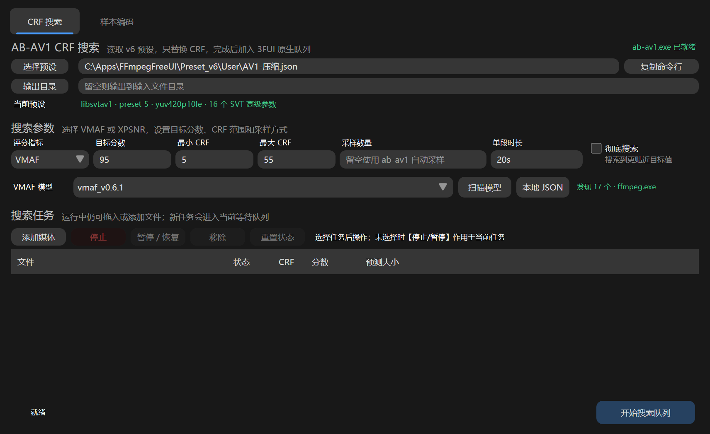

# FFmpegFreeUI AB-AV1 插件

> [!Note]
> 插件的v2.x版本开始面向最新版 3FUI（内置 LakeUI 5.5）适配，不再保证旧版 3FUI/LakeUI 的显示兼容性。

本插件会读取 FFmpegFreeUI v6 预设，并提供两个工作页：

- **CRF 搜索**：把影响画面质量的编码参数交给 `ab-av1 crf-search`，按目标 VMAF 或 XPSNR 搜索 CRF；成功后仅替换预设中的 CRF，再把正式编码任务加入 3FUI 原生编码队列。
- **样本编码**：调用 `ab-av1 sample-encode`，评估指定 CRF 的 VMAF/XPSNR、预测视频流大小和完整编码耗时；结果只用于评估，不加入正式编码队列。




## 使用的官方接口

- `SetHost_AddCustomWinformPanel`：注册左侧 `AB-AV1` 页面。
- `SetHost_AddMissionToQueueWith3fuiFile`：用搜索完成后的临时 v6 预设加入 3FUI 原生编码队列。

## 安装

1. 编译或取得 `dist\FFmpegFreeUI.AbAv1.3fui.dll`。
2. 将插件 DLL 和 `ab-av1.exe` 放进 FFmpegFreeUI 的同一个 `Plugin` 目录：

```text
FFmpegFreeUI.exe
Plugin\
├─ FFmpegFreeUI.AbAv1.3fui.dll
└─ ab-av1.exe
```

3. 建议使用最新版 [**ab-av1 0.11.7**](https://github.com/alexheretic/ab-av1/releases/tag/v0.11.7)。旧版本缺少能力时会由 ab-av1 返回明确错误；0.11.7 可使用插件支持的 XPSNR 和结构化 JSON 结果。
4. 确保 `ffmpeg` 可通过 FFmpegFreeUI 的当前目录或系统 `PATH` 正常找到。使用 VMAF 时需包含 `libvmaf`，使用 XPSNR 时需包含 `xpsnr` 滤镜。
5. 完全退出并重新启动 FFmpegFreeUI。左侧应出现 `AB-AV1`。

## 基本流程

1. 在 3FUI 中设置 `libsvtav1`、preset、像素格式、SVT 高级参数、音频、字幕、附件、章节、映射及输出容器，然后保存为 v6 JSON 预设。
2. 打开 `AB-AV1` 的“CRF 搜索”页，选择该预设和可选的输出目录。
3. 选择 VMAF 或 XPSNR，设置目标分数、CRF 范围、采样数量、单段时长和彻底搜索；VMAF 模式还可指定模型。
4. 点击“添加媒体”或直接把文件拖进页面；点击“开始搜索队列”。
5. 每个搜索成功的任务会显示 CRF、指标分数和预测视频大小，并立即加入 3FUI 原生编码队列。

需要只评估某个 CRF 时，切换到“样本编码”页，选择评分指标并输入 CRF，然后添加文件并开始样本队列。该页支持与 CRF 搜索页一致的拖放、停止、暂停/恢复、移除、重置和右键任务操作，但不会改写预设或创建正式编码任务。

## 复制命令行

- 两个页面预设路径右侧的“复制命令行”会按当前页面、预设与参数生成 `crf-search` 或 `sample-encode` 命令行模板，其中 `"<输入文件>"` 是待替换的输入路径。
- 在任务列表中右键某一任务，选择“复制此任务的完整命令行”，可以复制带有该任务真实输入路径的完整命令。已经启动过的任务会保留当时实际使用的命令；尚未启动的任务则按当前预设和搜索参数生成。
- 命令会根据同目录 `ab-av1.exe` 的能力决定是否包含 JSON 输出参数，与插件实际运行逻辑保持一致。

## 个性化背景

插件页面使用名为 `ModernPanel1`、填满页面的 LakeUI `ModernPanel` 作为根底板。支持个性化背景的 3FUI 会自动识别该容器，在启用 Supporter Pack 毛玻璃背景时为其注入透明背景映射；普通主题下继续使用原有深色背景，无需插件自行读取 3FUI 设置或调用非官方接口。

## 搜索任务管理

- **开始搜索队列**：依次处理所有“等待”任务。
- **停止**：停止所选任务；未选择时作用于当前任务。等待任务直接变为“已停止”，活动任务会取消并结束 `ab-av1` 及其 FFmpeg 子进程。
- **暂停 / 恢复**：只处理所选任务中的“搜索中”和“已暂停”项，等待或结束项不受影响。只要选择中存在搜索中任务，本次操作就是暂停；仅当所有可操作项均已暂停时，本次操作才是恢复。未选择时作用于当前任务。暂停会同时冻结 `ab-av1` 和已经启动的 FFmpeg 子进程。
- **移除**：移除所选的非活动任务。运行中、已暂停或正在停止的任务需先停止。
- **重置状态**：清除所选非活动任务的结果和错误，并恢复为“等待”；若搜索队列仍在运行，会自动重新处理。

任务状态包括：等待、搜索中、已暂停、正在停止、已入队、失败、已停止。

也可以在任务列表中右键：菜单会按当前选择动态提供复制完整命令行、开始、停止、暂停/恢复、重置和移除操作。右键一个尚未选中的任务会先选中该任务；右键已有选择会保留多选，复制命令始终作用于鼠标所指的单个任务。

## 评分指标与 VMAF 模型

- VMAF 模式分别生成 `--min-vmaf <目标分数>` 或默认的 `sample-encode` VMAF 评估参数。
- XPSNR 模式分别生成 `--min-xpsnr <目标分数>` 或 `sample-encode --xpsnr`；此时 VMAF 模型整行自动隐藏。
- XPSNR 分数允许为负数，插件会按 ab-av1 的 JSON 数值原样显示。

仅在 VMAF 模式下，模型框支持三种方式：

- 留空：不传 `--vmaf`，完全使用 ab-av1 的自动模型逻辑。
- 内置模型：点击“扫描模型”，或直接输入模型名称，例如 `vmaf_v0.6.1`。
- 本地模型：点击“本地 JSON”，或输入模型 JSON 的完整路径。

扫描逻辑参考 3FUI：先运行当前默认 `ffmpeg -hide_banner -h filter=libvmaf` 读取默认模型，再扫描 FFmpeg 及同目录下的 `avfilter` / `libavfilter` / `libvmaf` 运行库中的内置模型名。内置名称按 `model=version=...` 传给 ab-av1，本地文件按 `model=path=...` 传入；Windows 路径会自动按 FFmpeg 滤镜语法转义。

## 预设参数映射

CRF 搜索和样本编码阶段都会映射以下画面参数：

| FFmpegFreeUI 设置 | ab-av1 参数 |
|---|---|
| `libsvtav1` | `--encoder libsvtav1` |
| 编码预设 | `--preset` |
| 像素格式 | `--pix-format` |
| `svtav1-params` 中的 `keyint` | `--keyint` |
| `svtav1-params` 中的 `scd` | `--scd` |
| 其余 SVT 参数 | 每项一个 `--svt key=value` |
| 自定义视频编码参数 | `--enc key=value` |
| 自定义视频滤镜 | `--vfilter` |

原 CRF 不会传入 CRF 搜索；样本编码页则使用用户指定的 CRF。CRF 搜索成功后，插件写入：

- `视频参数_比特率_控制方式 = 1`（CRF）
- `视频参数_质量控制_参数名 = crf`
- `视频参数_质量控制_值 = 搜索结果`

如果 `-svtav1-params` 中手写了 `crf=...`，该值也会同步替换，避免覆盖 FFmpeg 的 `-crf`。音频、字幕、附件、章节、元数据和流映射不参与采样，但仍由最终的 3FUI 原生预设处理。

以下这类 SVT 高级参数会保留并参与 CRF 测试：

```text
-svtav1-params tune=0:keyint=8s:enable-tf=2:enable-cdef=1:
cdef-scaling=12:enable-dlf=2:enable-qm=1:qm-min=4:chroma-qm-min=10:
enable-variance-boost=1:variance-boost-strength=1:tile-columns=0:
tile-rows=0:film-grain=4:film-grain-denoise=1:sharpness=1:ac-bias=1
```

## 构建和测试

要求 Windows 10+ 和 .NET 10 SDK。

```powershell
dotnet restore .\FFmpegFreeUI.AbAv1.vbproj
dotnet build .\FFmpegFreeUI.AbAv1.vbproj -c Release --no-restore
```


## 当前限制

- 当前只支持 `libsvtav1` 和 FFmpegFreeUI v6 JSON 预设。
- 3FUI 内置缩放、裁剪、帧率转换、插帧、降噪、锐化、字幕烧录、色彩转换、帧服务器、剪辑区间等尚未等价映射给 ab-av1；检测到这些设置时会拒绝搜索，避免采样处理链与最终编码不一致。
- 自定义视频滤镜通过 `--vfilter` 传入；改变尺寸、时间轴或帧率的复杂滤镜仍需人工核对。
- ab-av1 的预测大小仅指视频流，最终文件还会包含音频、字幕和附件。
- 推荐以 ab-av1 0.11.7 为运行基线；插件仍保留对不支持 JSON 输出的旧版本的人类可读结果回退解析，但新版功能以 0.11.7 的命令行与 NDJSON 格式验证。
- 暂停/恢复进程树使用 Windows 进程接口，因此插件仅面向 Windows。

## 许可证

项目当前采用 MIT 许可证，但其所引用的 LakeUI 包要求社区版本采用 `GPL 3.0 only` 许可，作者已购买赞助者许可，因此采用了 MIT 许可证发布。若你的 LakeUI 采用了其他许可，应以该许可文本为准，再决定是否调整本项目许可证；本仓库不替授权合同作额外解释。
